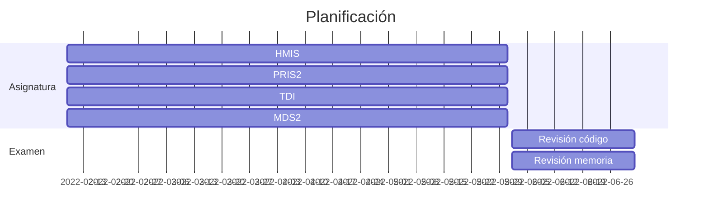

# Primera página GitHub

Esta es mi página personal de GitHub.

### Lenguajes que conozco

1. Java
2. C
3. C++

### Herramientas nuevas que he empezado a estudiar

1. Markdown
2. Mermaid
3. GitHub
4. LaTeX

### Planificación del curso

La planificación del segundo cuatrimestre.

### Mi contacto

Puede contactarme a través de mi [email](rrs999@inlumine.ual.es) y ver mis trabajos en mi [página GitHub](https://github.com/rk400).
